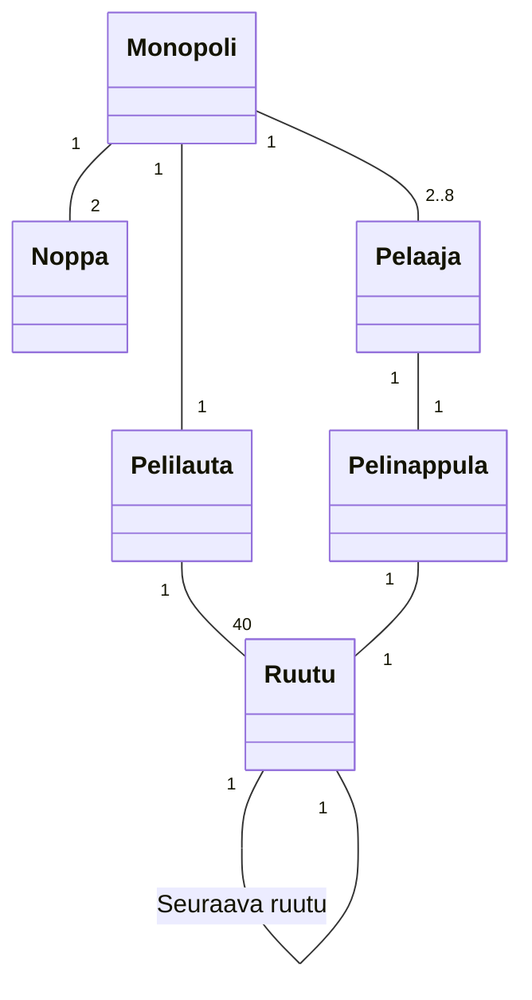
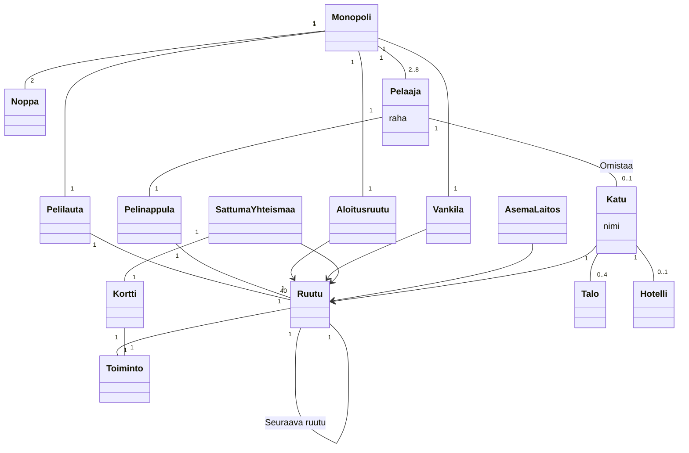
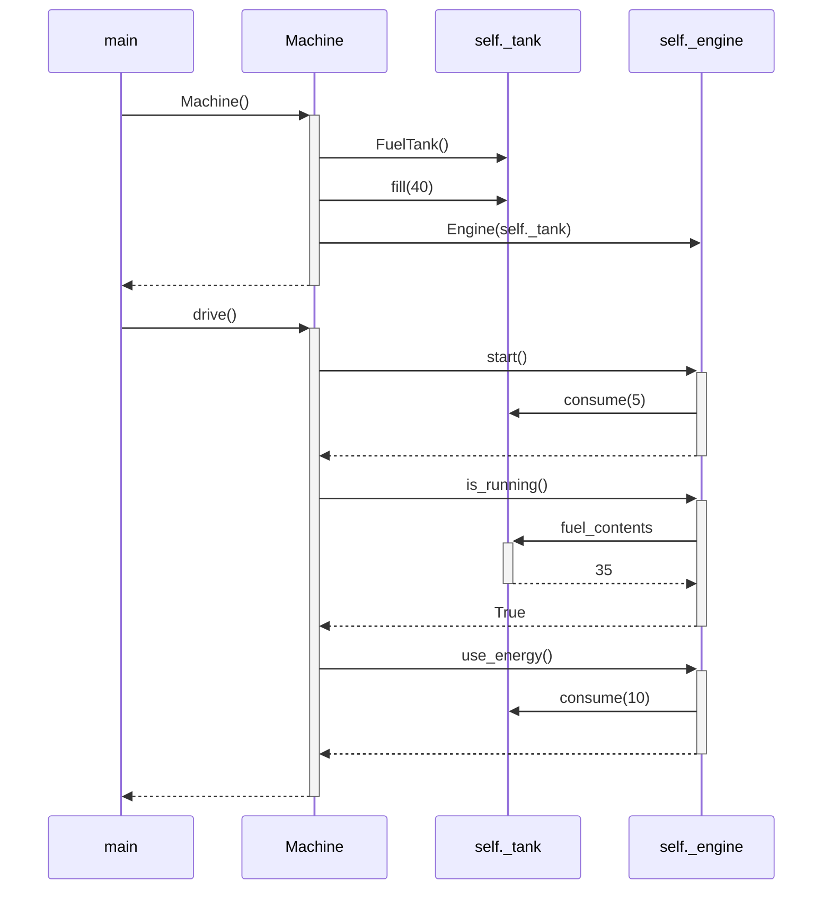
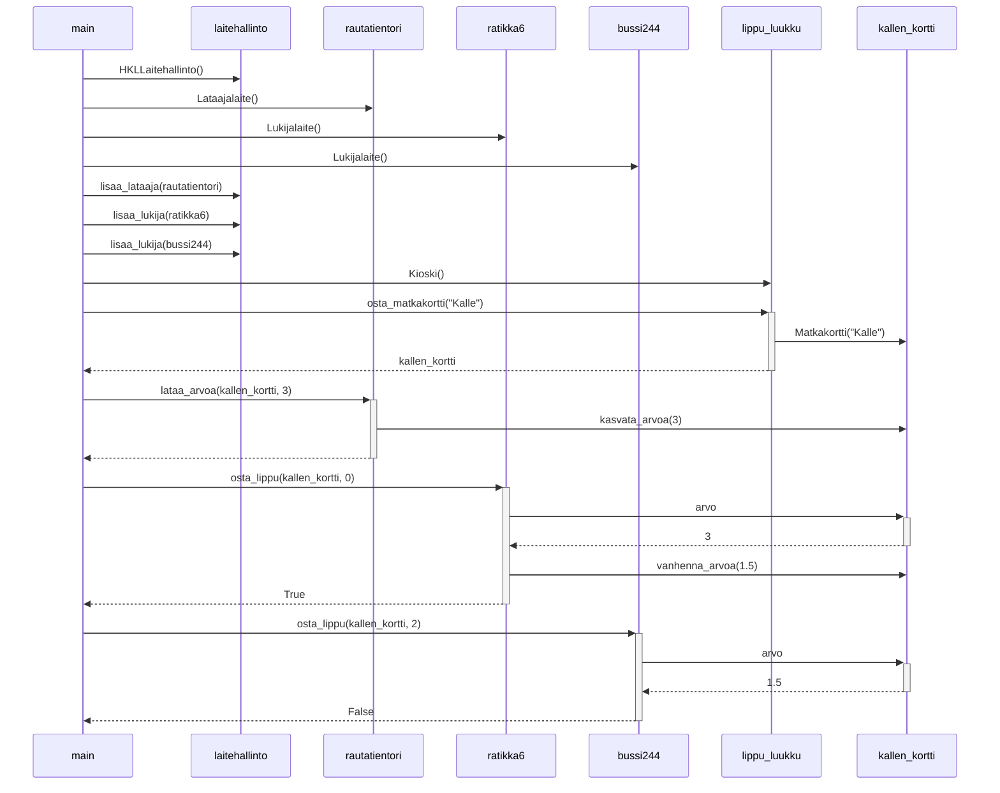

# viikko 3 kaavioita

## tehtävä 1

```mermaid
classDiagram
Monopoli "1" -- "2" Noppa
Monopoli "1" -- "2..8" Pelaaja
Monopoli "1" -- "1" Pelilauta
Pelilauta "1" -- "40" Ruutu
Ruutu "1" -- "1" Ruutu : Seuraava ruutu
Pelaaja "1" -- "1" Pelinappula
Pelinappula "1" -- "1" Ruutu
```

## tehtävä 2

```mermaid
classDiagram
Monopoli "1" -- "2" Noppa
Monopoli "1" -- "2..8" Pelaaja
Monopoli "1" -- "1" Pelilauta
Pelilauta "1" -- "40" Ruutu
Ruutu "1" -- "1" Ruutu : Seuraava ruutu
Pelaaja "1" -- "1" Pelinappula
Pelinappula "1" -- "1" Ruutu

Aloitusruutu --> Ruutu
Vankila --> Ruutu
SattumaYhteismaa --> Ruutu
AsemaLaitos --> Ruutu
Katu --> Ruutu

class Katu {
nimi
}
class Pelaaja {
raha
}

Monopoli "1" -- "1" Vankila
Monopoli "1" -- "1" Aloitusruutu

Ruutu "1" -- "1" Toiminto
SattumaYhteismaa "1" -- "1" Kortti
Kortti "1" -- "1" Toiminto
Pelaaja "1" -- "0..1" Katu : Omistaa
Katu "1" -- "0..4" Talo
Katu "1" -- "0..1" Hotelli
```

## Tehtävä 3

```mermaid
sequenceDiagram
participant main
participant Machine
participant FuelTank as self._tank
participant Engine as self._engine
main ->>+ Machine: Machine()
Machine ->> FuelTank: FuelTank()
Machine ->> FuelTank: fill(40)
Machine ->> Engine: Engine(self._tank)
Machine -->>- main: #160;

main ->>+ Machine: drive()
Machine ->>+ Engine: start()
Engine ->> FuelTank: consume(5)
Engine -->>- Machine: #160;
Machine ->>+ Engine: is_running()
Engine ->>+ FuelTank: fuel_contents
FuelTank -->>- Engine: 35
Engine -->>- Machine: True
Machine ->>+ Engine: use_energy()
Engine ->> FuelTank: consume(10)
Engine -->>- Machine: #160;
Machine -->>- main: #160;
```

## Tehtävä 4

```mermaid
sequenceDiagram
participant main
participant lh as laitehallinto
participant rlat as rautatientori
participant rluk as ratikka6
participant bluk as bussi244
participant Kioski as lippu_luukku

main ->> lh: HKLLaitehallinto()
main ->> rlat: Lataajalaite()
main ->> rluk: Lukijalaite()
main ->> bluk: Lukijalaite()

main ->> lh: lisaa_lataaja(rautatientori)
main ->> lh: lisaa_lukija(ratikka6)
main ->> lh: lisaa_lukija(bussi244)

main ->> Kioski: Kioski()
main ->>+ Kioski: osta_matkakortti("Kalle")
Kioski ->> kallen_kortti: Matkakortti("Kalle")
Kioski -->>- main: kallen_kortti

main ->>+ rlat: lataa_arvoa(kallen_kortti, 3)
rlat ->> kallen_kortti: kasvata_arvoa(3)
rlat -->>- main: #160;

main ->>+ rluk: osta_lippu(kallen_kortti, 0)
rluk ->>+ kallen_kortti: arvo
kallen_kortti -->>- rluk: 3
rluk ->> kallen_kortti: vanhenna_arvoa(1.5)
rluk -->>- main: True

main ->>+ bluk: osta_lippu(kallen_kortti, 2)
bluk ->>+ kallen_kortti: arvo
kallen_kortti -->>- bluk: 1.5
bluk -->>- main: False

```
