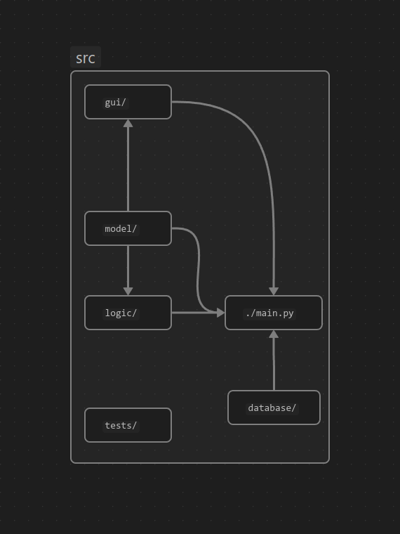

# Arkkitehtuurikuvaus (5.2.)

## Rakenne

Ohjelman rakenne jakautuu neljään osaan: Käyttöliittymästä vastaavaan pakettiin `gui`, pelin olioista (palat, ruudukko) vastaavaan pakettiin `models`, olioiden interaktioista ja muusta pelilogiikasta vastaavaan pakettiin `logic` ja juurikansiossa sijaitsevaan `main.py` -moduuliin, joka yhdistää näitä paketteja (erityisesti käyttöliittymän muihin). Rakennetta kuvaa pakkauskaavio:



Jossa nuolet edustavat riippuvaisuuksia (`main.py` riippuvainen kaikista, sisällytetty havainnollistaakseen rakennetta). Testipakkaus sisällytetty kuvaan, mutta ei ole osa sovelluksen tavanomaista toimintaa.

## Käyttöliittymä

Sovellus sulkeutuu kaikissa olosuhteissa Escape -näppäimestä.

Sovelluksella on kaksi näkymää:
 - Aloitusnäkymä, joka näytetään, kun peliä ei ole aloitettu tai se on loppunut. Peliin pääsee painamalla mitä nappia tahansa paitsi Escape -nappia.
 - Pelinäkymä, joka näyttää pelin tilan, eli ruudukon, pisteet ja putoavan palan.

Pelinäkymässä käyttäjä voi liikuttaa palaa nuolinäppäimillä ja "WASD" -näppäimillä. Peli päivittää näkymän ja vastaanottaa painalluksia 10 kertaa sekunnissa.

Käyttöliittymä on eristetty logiikasta käytännössä kokonaan. Käyttöliittymän ainoa riippuvuus on ruudukon luokkaan `Grid`, josta se tarkistaa mitkä ruudut merkitä täytetyiksi ja muuten sille toimitetaan vain pisteet kokonaislukuna. Vain osia yhdistävä `main()` -funktio kutsuu `gui/` -pakkauksen funktioita.

## Sovelluslogiikka


Ylläoleva kaavio kuvaa sovelluksen loogista tiedonkulkua. Nuolet mallista kuvaa konstuktiota, muuten kyse on argumenteista tai palautuksista. Ruudukkoja on yksi ja pelilogiikka kutsuu sen metodeja muokatakseen sitä. Pelilogiikka luo palikoita tarvittaessa ja liikefunktiot kutsuu palikan metodeja liikuttaakseen sitä. Pelilogiikka käyttää palikoita määrittääkseen miltä ruudukon kuuluisi näyttää. Logiikka myös päivittää `score`  -arvon ja päivittää rivejä. Jos metodikutsut olisi kuvattuna, logiikasta menisi kutsuja malleihin kaikista funktioista.

Sovelluksella ei ole pysyväistallennusta 2.5.

## Pelin kulkua sekvenssikaavioilla

### Pelin käynnistys

```mermaid
sequenceDiagram
    actor User
    participant gui/
    participant main()
    participant other*
    main() ->> gui/ : render menu
    gui/ -->> User : Menu view
    main() ->> gui/ : is key pressed?
    User ->> gui/ : keypress
    gui/ -->> main() : True
    main() ->> main() : normal game loop start
    main() ->> other* : [calls]
    other* -->> main() : [returns]
    main() ->> gui/ : render game
    gui/ -->> User : Game view
```


### Pelin validi kierros (jolla peli ei liikuta palaa)

```mermaid
sequenceDiagram
    actor User
    participant gui/
    participant main()
    participant logic/
    participant model/Grid
    participant model/Block
    gui/ -->> User : Game view
    main() ->> gui/ : is relevant key pressed?
    User ->> gui/ : left arrowkey
    gui/ -->> main() : left
    main() ->> logic/ : state, key(left)
    logic/ ->> logic/ : user_move(left)
    logic/ ->> model/Block : get points
    model/Block -->> logic/ : points
    logic/ ->> model/Grid : Clear block points
    logic/ ->> model/Block : move_left
    logic/ ->> model/Grid : is grid at new block full?
    model/Grid -->> logic/ : False
    logic/ ->> model/Block : get points
    model/Block -->> logic/ : points
    logic/ ->> model/Grid : Update grid
    logic/ -->> main() : state
    main() ->> gui/ : render game
    gui/ ->> model/Grid : Where is the grid filled?
    model/Grid -->> gui/ : (grid points)
    gui/ -->> User : Game view
```

Jos palikkaa ei voi siirtää, niin kierros on lähes identtinen, vain täyden ruudukon kohdalla palikalle olisi tehty kutsu "unmove()" ja muuten jatkettu samalla tavalla

### Pelin kierros, kun peli liikuttaa palaa ja rivi täyttyy (ja käyttäjä sattumalta ei)

```mermaid
sequenceDiagram
    actor User
    participant gui/
    participant main()
    participant logic/
    participant model/Grid
    participant model/Block
    gui/ -->> User : Game view
    main() ->> gui/ : is relevant key pressed?
    User ->> gui/ : left arrowkey
    gui/ -->> main() : left
    main() ->> logic/ : state, key(-)
    logic/ ->> logic/ : is game turn, game_move
    logic/ ->> model/Block : get points
    model/Block -->> logic/ : points
    logic/ ->> model/Grid : Clear block points
    logic/ ->> model/Block : move_down
    logic/ ->> model/Grid : is grid at new block full?
    model/Grid -->> logic/ : False
    logic/ ->> model/Block : get points
    model/Block -->> logic/ : points
    logic/ ->> model/Grid : Update grid
    logic/ ->> logic/ : check score
    logic/ ->> model/Grid : Is row full? (n times)
    model/Grid -->> logic/ : [some return is True]
    logic/ ->> model/Grid : Remove row, shift above
    logic/ ->> logic/ : update score
    logic/ -->> main() : state
    main() ->> gui/ : render game
    gui/ ->> model/Grid : Where is the grid filled?
    model/Grid -->> gui/ : (grid points)
    gui/ -->> User : Game view
```

### Muu

Peli päättyy jos uutta palikkaa ei voi luoda ilman konfliktia, jolloin logiikka kertoo juurelle että peli on ohi. Tämä muistuttanee aloitusta jokseenkin.

Muuten pelin vuorot menee aikalailla kuvatusti riippumatta mitä liikkeitä tehdään. pelaaja ja peli voi liikuttaa palaa samalla vuorolla ja se voi onnistua tai olla onnistumatta. Pelaajan liike aina katsotaan ensin.


## Tämän dokumentaation heikkoudet

Sekvenssikaaviot ovat rajallisia ollakseen luettavia. Järkevä kuvaus vaatisi muutaman lisää, ainakin uuden palikan luonti voisi vielä kaivata. Kuitenkin näitä on jo aika monta, joten jottei dokumentti paisu kaikkia ei kuvata mielekkäästi. Logiikka- ja pakkauskaaviot eivät ole kovin selkeitä nykymuodossaan ja en ole varma miten selkeiten kaaviolla kuvata ohjelman rakennetta (vaikka rakenne itsessään on huomattavan luonteva mielestäni).