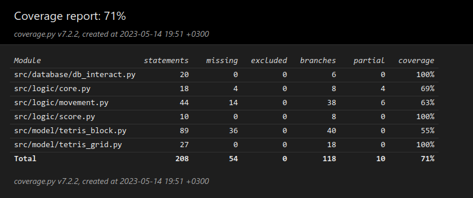

# Testausdokumentaatio

Ohjelmaa on testattu automaattisilla yksikkö- ja integraatio testeillä, sekä manuaalisesti pelaamalla peliä ja etsimällä siten ilmeisiä virheitä.

### Yksikkö- ja integraatiotestit

Testit on tehty automaattisesti unittest -kirjastolla. Jokaiselle paketille on oma joukko testejä, poislukien käyttöliittymän paketin `gui`. 

### model -paketin testit

`model` paketti vastaa pelin tietorakenteita mallintavista luokista. Pakettia testaa `grid_test.py`:n `TestGrid` -luokka, joka testaa peliruudukon toimintaa ja `line_test.py`:n ja `square_test.py`:n luokat `TestLine` ja `TestSquare`, jotka testaa tetrispaloja mallintavan luokan toimintaa.

Peliruudukon testit testaavat, että ruudukkoon lisääminen ja sieltä tiedon lukeminen tuottaa odotetut tulokset. Testataan myös ruudukon menetelmiä suurempiin päivityksiin, kuten rivin poistamiseen Tetriksen tyylillä.

Kaksi palikkaluokkaa testaavat luokat testaavat, että nämä kaksi palikkatyyppiä toimii odotetusti lisäämisen ja siirtelyn puolesta. Testit eivät kata kaikkia palikkatyyppejä, eikä palikoiden pyörittämisen automaattitestaus toteutunut.

### logic -paketin testit

`logic` paketti vastaa lähes kaikesta pelin sovelluslogiikasta, sekä integraatioista pelin eri tietomuotojen (pisteiden, palikoiden ja ruudukon) välillä. Testeihin kuuluu `movement_test.py`, `score_test.py` ja `core_test.py`, jotka sisältävät luokat `TestMovementFunctions`, `TestScoreFunctions` ja `TestCoreFunctions`, jotka vastaavasti testaavat liikkeestä ja osumista vastaavaa moduulia `movement`, pistetunnistusta ja laskua vastaavasta moduulista `score` ja pelin pääsilmukasta vastaavaa moduulia `core`.

Pisteytysmoduuli on testattu melko kattavasti erillaisilla ruudukoilla. Testit tarkistaa, että rivejä poistetaan ja pisteitä lisätään vain kun kuuluu, ja että ruudukolle tehdään oikeat metodikutsut.

Liikemoduulia on testattu osittaisesti. Osumia tarkistavat funktiot on testattu melko kattavasti ja palojen tippumisen funktiota muutamalla skenariolla, mutta pelaajan liikkeiden funktiota ei ole testattu ollenkaan. Myös integraatiotestausta ei ole toteutettu paljon. 

Pelisilmukan moduulista on järkevät testit olemassa pelin alulle, mutta ei pelin normaalille kierrolle.

### database -paketin testit

`database` paketti vastaa tietokannan kanssa toimimisesta. Testimoduulin `database_test.py` luokka `TestDatabase` testaa, että kanta alustetaan oikein ja funktiot toimii odotetulla tavalla.

### Testikattavuus

Testikattavuuteen ei ole laskettu `gui` pakettia eikä `main.py` moduulia. `gui` pakettia ei laskettu, koska se käsittelee käyttöliittymää, `main.py` moduulia ei laskettu, koska se toimii välikätenä käyttöliittymän ja logiikan välillä.

## Manuaalinen testaus

Sovellusta on testattu pelaamalla peliä ja etsimällä virheitä. Sovellus on asennettu käyttöohjeen mukaisesti yliopiston virtuaalikoneelle, jossa peliä on pelattu muutama kierros etsien virheellistä toimintaa. Peli vaikuttaisi toimivan odotetulla tavalla yleisesti ottaen. Kuitenkin testauksen systemaattisuudessa olisi parantamisen varaa, joten on mahdollista, että jokin virhe on päässyt seulasta läpi.

Kaikki nykyisen määrittelydokumentin määrittämät toiminnallisuudet toteutuvat nykyisessä versiossa testaamisen pohjalta.

## Jäljellä olevat laatuongelmat

Käyttöliittymässä: Sovellus ei aina rekisteröi kaikkia napinpainalluksia ja joskus pitää rämpyttää, erityisesti pelin sulkemiseksi.